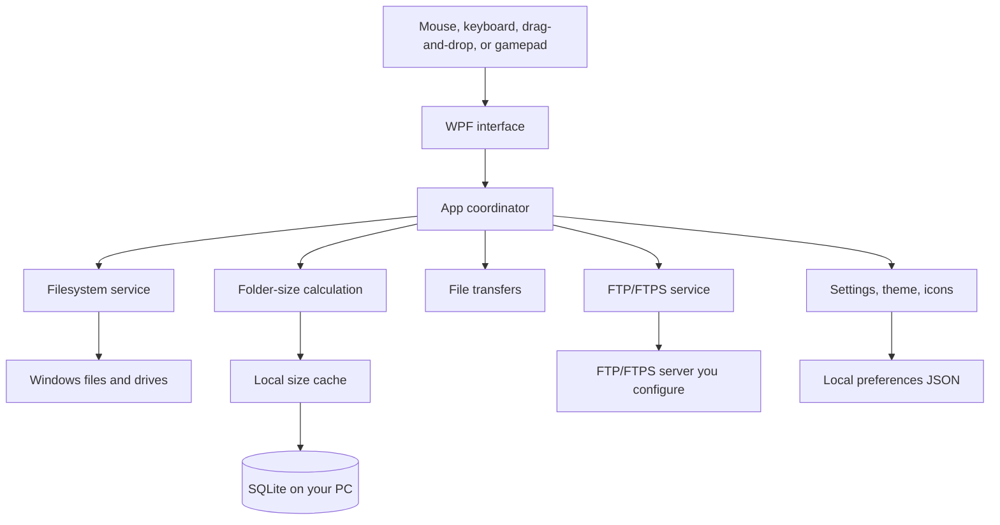

  

  <strong>See your folders. Know their size.</strong>

  
  
  

  <strong>English</strong> · <a href="README.pt-BR.md">Português (Brasil)</a>

  Folder Size Explorer is a free and portable file manager for Windows 10 and Windows 11 that shows the actual size of folders directly while you browse. It combines recursive folder-size analysis with everyday file management, Finder-style column navigation, a visual treemap, tabs, bookmarks, multiple view modes, and FTP/FTPS.

  I originally built Folder Size Explorer for myself because I wanted recursive folder-size analysis to feel like a natural part of everyday file browsing, not a separate tool. The goal is a lightweight file manager where finding what is taking up space feels built in instead of bolted on.

  Folder Size Explorer is <strong>proprietary freeware</strong>: personal and internal business use is free, with no Pro version, locked features, subscription, or telemetry. This repository is the official public distribution channel; the source code is private.

  <a href="#download">Download</a>
  ·
  <a href="#features">Features</a>
  ·
  <a href="#screenshots">Screenshots</a>
  ·
  <a href="#support">Support</a>
  ·
  <a href="#license">License</a>

  

## Download

- [Download the latest release](https://github.com/ribeirogustav/FolderSizeExplorer-Releases/releases/latest)
- Current version: `1.0.1`
- Asset: `FolderSizeExplorer-1.0.1-win-x64.exe`
- Target: Windows 10/11 x64

The portable executable is self-contained and does not require a separate .NET installation.

## Installation

1. Download `FolderSizeExplorer-1.0.1-win-x64.exe` from the official release page.
2. Optionally verify its SHA-256 checksum against the checksum published with the release.
3. Move the executable to a local folder and run it.

The application runs as the current user and does not automatically request administrator privileges. The current executable is not digitally signed, so Windows SmartScreen may display a warning.

## Screenshots

| Details + treemap + bookmark bar | Bookmark folder open |
| --- | --- |
|  |  |

| Arabic UI (RTL) | FTP connection |
| --- | --- |
|  |  |

| Language settings |
| --- |
|  |

## Features

- Asynchronous recursive folder-size calculation
- In-memory and SQLite size cache
- View modes: Details, Columns (Miller/Finder-like), Grid, and Dual pane
- Visual size map (treemap) for the largest visible items
- Tabs, recents, and a **Chrome-style bookmark bar** (folders/groups, custom icons, overflow)
- Local and recursive filename search
- Local file operations and drag-and-drop
- CSV/JSON export and size comparison
- Interface available in 21 locales
- XInput gamepad navigation aids
- **FTP/FTPS**: browse, upload, download, and local↔remote transfers  
  (Automatic security tries FTPS first, then plain FTP)

## What is new in 1.0.1

- Chrome-style bookmark bar (idea suggested by [u/testednation](https://www.reddit.com/user/testednation/))
- Full FTP/FTPS operations (no longer browse-only)
- Automatic FTP security mode and clearer connection UI
- Safer startup: missing/slow/FTP last paths open **This PC**

See [CHANGELOG.md](CHANGELOG.md) for the full list.

## Architecture

The WPF interface talks to a central coordinator that uses dedicated services for the filesystem, folder-size calculation, file transfers, optional FTP/FTPS, and local settings. Size results can be cached locally in SQLite on your PC.

## Security and privacy

- No telemetry in the executable
- Settings, cache, and FTP profiles stay in the local Windows user profile
- FTP passwords use Windows DPAPI when “Remember password” is enabled
- FTPS uses standard Windows certificate validation

Report vulnerabilities privately to `gustavo@grcx.com.br`.  
See [SECURITY.md](docs/SECURITY.md) and [PRIVACY.md](docs/PRIVACY.md).

## Support

| Topic | Channel |
| --- | --- |
| Support | `support@grcx.com.br` |
| Non-sensitive bugs | <https://github.com/ribeirogustav/FolderSizeExplorer-Releases/issues> |
| Privacy / legal | `contact@grcx.com.br` |
| Security | `gustavo@grcx.com.br` |
| Donations | `billing@grcx.com.br` |
| Website | <https://www.grcx.com.br/> |
| External tip jar | <https://buymeacoffee.com/ribeirogustav> |

See also [SUPPORT.md](docs/SUPPORT.md).

## License

Copyright © 2026 Gustavo Ribeiro de Carvalho, doing business as GRCX. All rights reserved.

Proprietary freeware: personal and internal business use are allowed. Public redistribution, mirrors, modification, and reverse engineering are not authorized without written permission.

See [LICENSE](LICENSE) and [EULA.md](docs/EULA.md).
