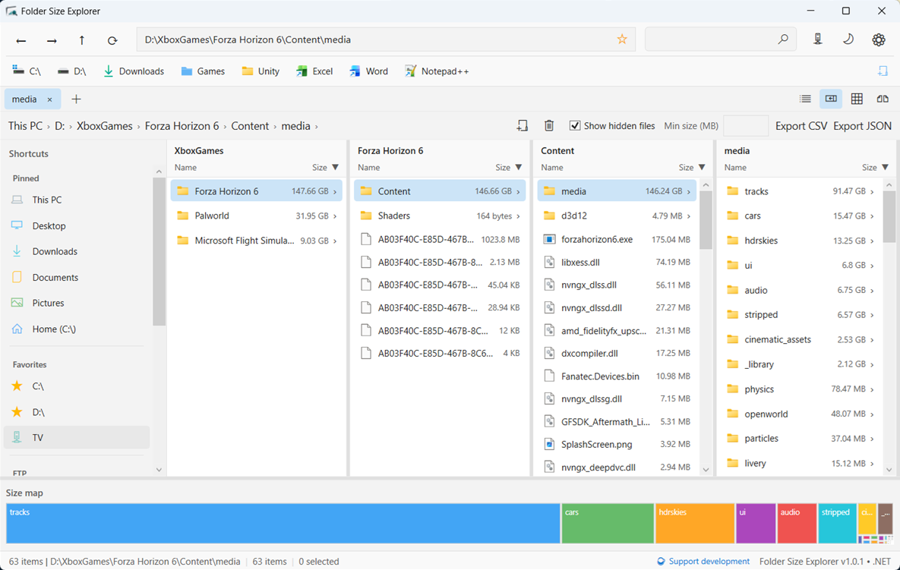
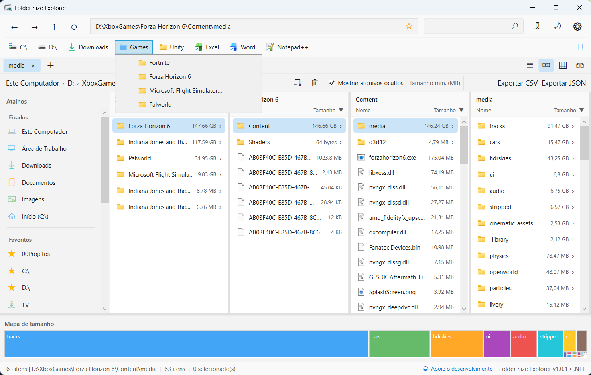
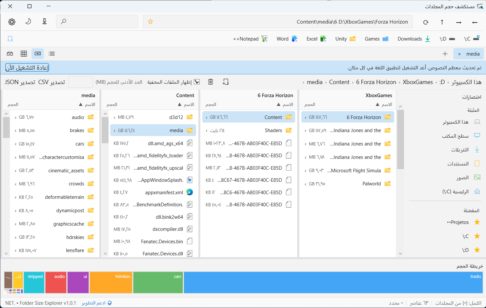
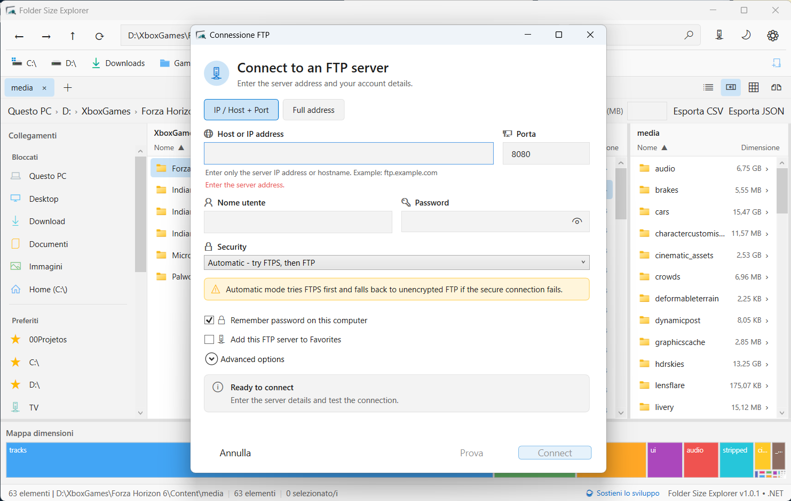
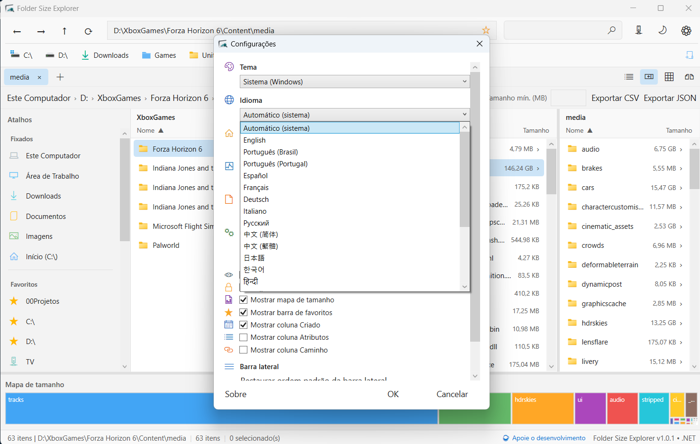

# Folder Size Explorer

**English** | [Português (Brasil)](README.pt-BR.md)

Folder Size Explorer is a proprietary Windows x64 desktop application that combines file browsing and management with recursive folder-size analysis, a Chrome-style bookmark bar, and FTP/FTPS.

This repository is the official public distribution channel. The source code is private and is not distributed here.

  

## Download

- [Download the latest release](https://github.com/ribeirogustav/FolderSizeExplorer-Releases/releases/latest)
- Current version: `1.0.1`
- Asset: `FolderSizeExplorer-1.0.1-win-x64.exe`
- Target: Windows 10/11 x64

The portable executable is self-contained and does not require a separate .NET installation.

## Installation

1. Download `FolderSizeExplorer-1.0.1-win-x64.exe` from the official release page.
2. Optionally verify its SHA-256 checksum against the checksum published with the release.
3. Move the executable to a local folder and run it.

The application runs as the current user and does not automatically request administrator privileges. The current executable is not digitally signed, so Windows SmartScreen may display a warning.

## Screenshots

| Details + treemap + bookmark bar | Bookmark folder open |
| --- | --- |
|  |  |

| Arabic UI (RTL) | FTP connection |
| --- | --- |
|  |  |

| Language settings |
| --- |
|  |

## Features

- Asynchronous recursive folder-size calculation
- In-memory and SQLite size cache
- Details, Columns, Grid, and Dual-pane views
- Visual size map (treemap) for the largest visible items
- Tabs, recents, and a **Chrome-style bookmark bar** (folders/groups, custom icons, overflow)
- Local and recursive filename search
- Local file operations and drag-and-drop
- CSV/JSON export and size comparison
- Interface available in 21 locales
- **FTP/FTPS**: browse, upload, download, and local↔remote transfers  
  (Automatic security tries FTPS first, then plain FTP)

## What is new in 1.0.1

- Chrome-style bookmark bar (idea suggested by [u/testednation](https://www.reddit.com/user/testednation/))
- Full FTP/FTPS operations (no longer browse-only)
- Automatic FTP security mode and clearer connection UI
- Safer startup: missing/slow/FTP last paths open **This PC**

See [CHANGELOG.md](CHANGELOG.md) for the full list.

## Security and privacy

- No telemetry in the executable
- Settings, cache, and FTP profiles stay in the local Windows user profile
- FTP passwords use Windows DPAPI when “Remember password” is enabled
- FTPS uses standard Windows certificate validation

Report vulnerabilities privately to `gustavo@grcx.com.br`.  
See [SECURITY.md](SECURITY.md) and [PRIVACY.md](PRIVACY.md).

## Support

- Support: `support@grcx.com.br`
- Privacy / legal: `contact@grcx.com.br`
- Security: `gustavo@grcx.com.br`
- Website: <https://www.grcx.com.br/>
- Issues (non-sensitive): <https://github.com/ribeirogustav/FolderSizeExplorer-Releases/issues>

## License

Copyright © 2026 Gustavo Ribeiro de Carvalho, doing business as GRCX. All rights reserved.

Proprietary freeware: personal and internal business use are allowed. Public redistribution, mirrors, modification, and reverse engineering are not authorized without written permission.

See [LICENSE](LICENSE) and [EULA.md](EULA.md).
