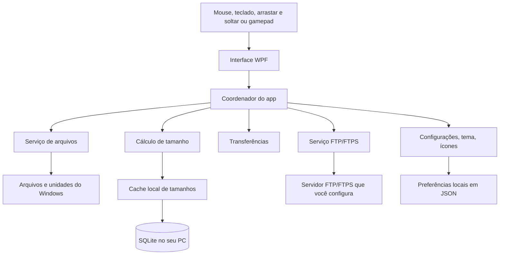

  

  <strong>Veja suas pastas. Saiba o tamanho delas.</strong>

  
  
  

  <a href="README.md">English</a> · <strong>Português (Brasil)</strong>

  Folder Size Explorer é um gerenciador de arquivos gratuito e portátil para Windows 10 e Windows 11 que mostra o tamanho real das pastas diretamente enquanto você navega. Ele combina análise recursiva de tamanho com gerenciamento de arquivos, navegação em colunas no estilo Finder, treemap visual, abas, favoritos, vários modos de visualização e FTP/FTPS.

  Eu criei o Folder Size Explorer originalmente para uso próprio porque queria que a análise recursiva do tamanho das pastas fizesse parte natural da navegação diária, e não fosse uma ferramenta separada. A ideia é ter um gerenciador leve em que descobrir o que está ocupando espaço seja parte do próprio fluxo de navegação.

  Folder Size Explorer é <strong>freeware proprietário</strong>: o uso pessoal e empresarial interno é gratuito, sem versão Pro, recursos bloqueados, assinatura ou telemetria. Este repositório é o canal oficial de distribuição pública; o código-fonte é privado.

  <a href="#download">Download</a>
  ·
  <a href="#recursos">Recursos</a>
  ·
  <a href="#capturas-de-tela">Capturas de tela</a>
  ·
  <a href="#suporte">Suporte</a>
  ·
  <a href="#licença">Licença</a>

  

   
  <em>Folder Size Explorer no Windows 11.</em>

## Download

- [Baixar a release mais recente](https://github.com/ribeirogustav/FolderSizeExplorer-Releases/releases/latest)
- Versão atual: `1.0.1`
- Arquivo: `FolderSizeExplorer-1.0.1-win-x64.exe`
- Plataforma: Windows 10/11 x64

O executável portable é self-contained e não exige instalação separada do .NET.

## Instalação

1. Baixe `FolderSizeExplorer-1.0.1-win-x64.exe` na página oficial de releases.
2. Opcionalmente confira o SHA-256 com o arquivo publicado na release.
3. Coloque o EXE em uma pasta local e execute.

O aplicativo roda como o usuário atual e não pede administrador automaticamente. O executável atual **não tem assinatura digital**; o Windows SmartScreen pode exibir um aviso.

## Capturas de tela

| Detalhes + treemap + barra de favoritos | Pasta de favoritos aberta |
| --- | --- |
|  |  |

| Interface em árabe (RTL) | Conexão FTP |
| --- | --- |
|  |  |

| Configuração de idioma |
| --- |
|  |

## Recursos

- Cálculo assíncrono de tamanho de pastas
- Cache em memória e SQLite
- Modos de visualização: Detalhes, Colunas (estilo Miller/Finder), Grade e Painel duplo
- Mapa de tamanho (treemap)
- Abas, recentes e **barra de favoritos estilo Chrome** (pastas/grupos, ícones, overflow)
- Busca por nome na pasta e em subpastas
- Operações locais e drag-and-drop
- Exportação CSV/JSON e comparação de tamanho
- Interface em 21 idiomas
- Atalhos de navegação com gamepad XInput
- **FTP/FTPS**: navegar, enviar, baixar e transferir local↔remoto  
  (modo Automático tenta FTPS e, se falhar, usa FTP)

## Novidades da 1.0.1

- Barra de favoritos estilo Chrome (sugestão de [u/testednation](https://www.reddit.com/user/testednation/))
- FTP/FTPS completo (não é mais só listagem)
- Segurança FTP Automática e janela de conexão mais clara
- Abertura mais segura: caminhos FTP/ausentes/lentos abrem em **Este Computador**

Veja o [CHANGELOG.md](CHANGELOG.md) para a lista completa.

## Arquitetura

A interface WPF conversa com um coordenador central que usa serviços dedicados para o sistema de arquivos, cálculo de tamanho de pastas, transferências, FTP/FTPS opcional e configurações locais. Os resultados de tamanho podem ser armazenados em cache SQLite no seu PC.

## Segurança e privacidade

- Sem telemetria no executável
- Configurações, cache e perfis FTP ficam no perfil local do Windows
- Senhas FTP usam DPAPI do Windows quando “Lembrar senha” está ativo
- FTPS usa a validação de certificado padrão do Windows

Reporte vulnerabilidades em privado: `gustavo@grcx.com.br`.  
Veja [SECURITY.md](docs/SECURITY.md) e [PRIVACY.md](docs/PRIVACY.md).

## Suporte

| Assunto | Canal |
| --- | --- |
| Suporte | `support@grcx.com.br` |
| Bugs não sensíveis | <https://github.com/ribeirogustav/FolderSizeExplorer-Releases/issues> |
| Privacidade / jurídico | `contact@grcx.com.br` |
| Segurança | `gustavo@grcx.com.br` |
| Doações | `billing@grcx.com.br` |
| Site | <https://www.grcx.com.br/> |
| Apoio externo | <https://buymeacoffee.com/ribeirogustav> |

Consulte também [SUPPORT.md](docs/SUPPORT.md).

## Licença

Copyright © 2026 Gustavo Ribeiro de Carvalho, atuando sob a marca GRCX. Todos os direitos reservados.

Freeware proprietário: uso pessoal e empresarial interno permitidos. Redistribuição pública, mirrors, modificação e engenharia reversa não são autorizados sem permissão escrita.

Veja [LICENSE](LICENSE) e [EULA.md](docs/EULA.md).
